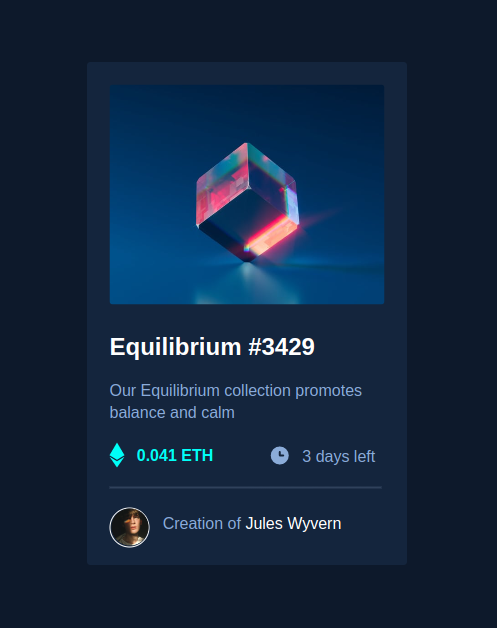

# Frontend Mentor - NFT preview card component solution

This is a solution to the [NFT preview card component challenge on Frontend Mentor](https://www.frontendmentor.io/challenges/nft-preview-card-component-SbdUL_w0U). Frontend Mentor challenges help you improve your coding skills by building realistic projects. 

## Table of contents

- [Overview](#overview)
  - [The challenge](#the-challenge)
  - [Screenshot](#screenshot)
  - [Links](#links)
- [My process](#my-process)
  - [Built with](#built-with)
- [Author](#author)

## Overview

### The challenge

Users should be able to:

- View the optimal layout depending on their device's screen size
- See hover states for interactive elements

### Screenshot

     
     

### Links

- Solution URL: [Link do repositório no GitHub](https://github.com/Creuma-Kuzola/NFT-card-preview)
- Live Site URL: [Link do site](https://card-preview-nft-creuma.netlify.app/)

## My process

### Built with

- Semantic HTML5 markup
- CSS custom properties
- CSS Grid
- Desktop-first workflow

## Author

- Frontend Mentor - [@Creuma-Kuzola](https://www.frontendmentor.io/profile/Creuma-Kuzola)
- GitHub - [@Creuma-Kuzola](https://github.com/Creuma-Kuzola)
- LinkedIn - [@Creuma Matias](https://www.linkedin.com/in/creumamatias/)
- Twitter - [@CKuzola](https://twitter.com/CKuzola)

